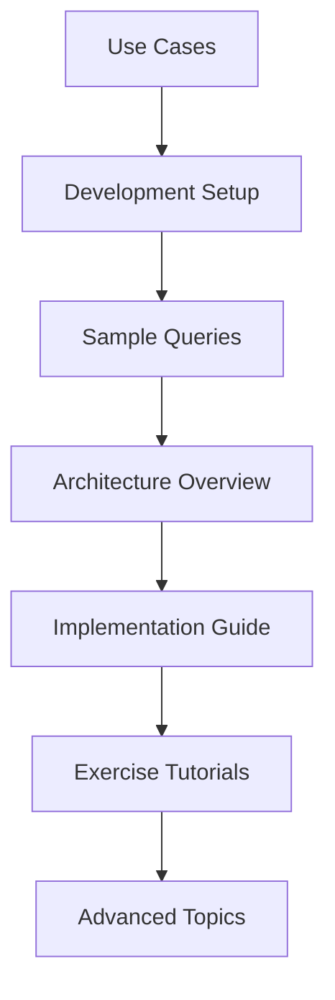

# Food Recomme### 🛠️ Development & Setup
- [**Development Setup**](development-setup.md) - Environment configuration
- [**Contributing Guidelines**](contributing.md) - How to contribute to the project
- [**API Documentation**](api-documentation.md) - Complete function reference
- [**Troubleshooting**](troubleshooting.md) - Common issues and solutions

### 📚 Exercises & Learning
- [**Exercise Scripts Guide**](../scripts/exercise_scripts/README.md) - Learning objectives and detailed explanations

### 🔮 Future Development
- [**Future Work & Roadmap**](future-work.md) - Planned enhancements and research opportunitiesn System - Complete Documentation

Welcome to the comprehensive documentation for the **Food Recommendation System with ChromaDB**. This project demonstrates advanced vector search and conversational AI techniques for food recommendations.

## 📚 Documentation Index

### 🏗️ System Architecture
- [**Architecture Overview**](architecture.md) - System design and component interactions
- [**Implementation Guide**](implementation.md) - Step-by-step development process

### 🎯 Use Cases & Applications  
- [**Use Cases**](use-cases.md) - Real-world applications and scenarios
- [**Sample Queries**](sample-queries.md) - Example searches and expected results

### �️ Development & Setup
- [**Development Setup**](development-setup.md) - Environment configuration
- [**Contributing Guidelines**](contributing.md) - How to contribute to the project

### 📚 Exercises & Learning
- [**Exercise Scripts Guide**](../scripts/exercise_scripts/README.md) - Learning objectives and detailed explanations

## 🚀 Quick Navigation

### For Beginners
1. Start with [**Use Cases**](use-cases.md) to understand what the system does
2. Follow [**Development Setup**](development-setup.md) to get running
3. Try [**Sample Queries**](sample-queries.md) to see it in action

### For Developers  
1. Review [**Architecture Overview**](architecture.md) for system understanding
2. Read [**Implementation Guide**](implementation.md) for technical details
3. Check [**API Documentation**](api-documentation.md) for function references

### For Researchers
1. Explore [**RAG System Design**](rag-system.md) for AI implementation
2. Study [**Comparison Studies**](comparison-studies.md) for performance analysis
3. Review [**ChromaDB Integration**](chromadb-integration.md) for vector search details

## 🎯 Learning Path

## 📊 Documentation Stats

| Section | Files | Status |
|---------|-------|---------|
| Architecture | 2 | ✅ Complete |
| Use Cases | 2 | ✅ Complete |
| Development | 4 | ✅ Complete |
| Exercises | 1 | ✅ Complete |
| Future Work | 1 | ✅ Complete |
| **Total** | **10** | **✅ Complete** |

## � Future Work & Roadmap

### 📋 **Planned Enhancements**
- **API Documentation** - Comprehensive function reference
- **Performance Optimization Guide** - Speed and memory improvements  
- **Testing Framework** - Unit and integration testing setup
- **Advanced Tutorials** - Multi-modal search, personalization
- **Troubleshooting Guide** - Common issues and solutions

### 🚀 **Potential Extensions**
- **Web Interface** - Browser-based UI for wider accessibility
- **Mobile API** - REST endpoints for mobile app integration
- **Advanced RAG** - Multi-modal search with images
- **Personalization** - User preference learning and adaptation
- **Performance Monitoring** - Real-time metrics and analytics

See [Future Work](future-work.md) for detailed roadmap and contribution opportunities.

## �🔗 External Resources

- [ChromaDB Documentation](https://docs.trychroma.com/)
- [Hugging Face Transformers](https://huggingface.co/docs/transformers)
- [Sentence Transformers](https://www.sbert.net/)
- [Pixi Package Manager](https://pixi.sh/)

---

📝 **Last Updated**: December 2024  
🚀 **Version**: 1.0.0  
👥 **Maintained by**: Food Recommendation Team