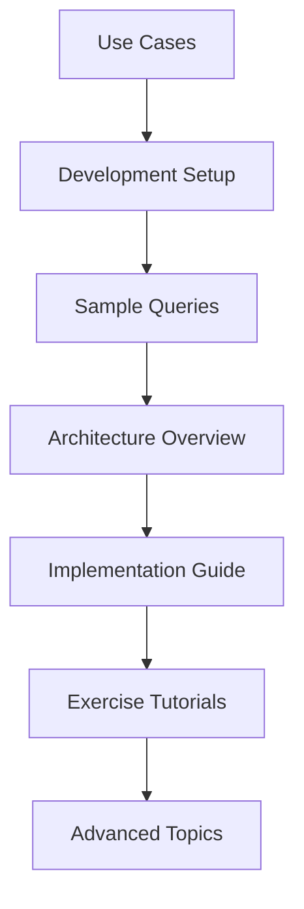

# Food Recommendation System - Complete Documentation

Welcome to the comprehensive documentation for the **Food Recommendation System with ChromaDB**. This project demonstrates advanced vector search and conversational AI techniques for food recommendations.

## 📚 Documentation Index

### 🏗️ System Architecture
- [**Architecture Overview**](architecture.md) - System design and component interactions
- [**Technical Stack**](tech-stack.md) - Detailed technology choices and rationale
- [**Data Flow**](data-flow.md) - How data moves through the system

### 🎯 Use Cases & Applications  
- [**Use Cases**](use-cases.md) - Real-world applications and scenarios
- [**Sample Queries**](sample-queries.md) - Example searches and expected results
- [**Comparison Studies**](comparison-studies.md) - Performance vs other approaches

### 🔧 Implementation Details
- [**Implementation Guide**](implementation.md) - Step-by-step development process
- [**ChromaDB Integration**](chromadb-integration.md) - Vector database setup and usage
- [**RAG System Design**](rag-system.md) - Retrieval-Augmented Generation implementation
- [**LLM Integration**](llm-integration.md) - Hugging Face FLAN-T5 usage

### 🧪 Exercises & Learning
- [**Exercise Overview**](exercises.md) - Learning objectives and progression
- [**Interactive Search Tutorial**](interactive-search-tutorial.md) - CLI interface development
- [**RAG Chatbot Tutorial**](rag-chatbot-tutorial.md) - Conversational AI implementation

### 🛠️ Development & Deployment
- [**Development Setup**](development-setup.md) - Environment configuration
- [**API Documentation**](api-documentation.md) - Function and class references
- [**Performance Optimization**](performance-optimization.md) - Speed and efficiency tips
- [**Troubleshooting**](troubleshooting.md) - Common issues and solutions

### 🤝 Contributing & Community
- [**Contributing Guidelines**](contributing.md) - How to contribute to the project
- [**Code Style Guide**](code-style.md) - Coding standards and best practices
- [**Testing Guide**](testing.md) - Unit and integration testing

## 🚀 Quick Navigation

### For Beginners
1. Start with [**Use Cases**](use-cases.md) to understand what the system does
2. Follow [**Development Setup**](development-setup.md) to get running
3. Try [**Sample Queries**](sample-queries.md) to see it in action

### For Developers  
1. Review [**Architecture Overview**](architecture.md) for system understanding
2. Read [**Implementation Guide**](implementation.md) for technical details
3. Check [**API Documentation**](api-documentation.md) for function references

### For Researchers
1. Explore [**RAG System Design**](rag-system.md) for AI implementation
2. Study [**Comparison Studies**](comparison-studies.md) for performance analysis
3. Review [**ChromaDB Integration**](chromadb-integration.md) for vector search details

## 🎯 Learning Path

## 📊 Documentation Stats

| Section | Files | Status |
|---------|-------|---------|
| Architecture | 3 | ✅ Complete |
| Use Cases | 3 | ✅ Complete |
| Implementation | 4 | ✅ Complete |
| Tutorials | 3 | ✅ Complete |
| Development | 4 | ✅ Complete |
| **Total** | **17** | **✅ Complete** |

## 🔗 External Resources

- [ChromaDB Documentation](https://docs.trychroma.com/)
- [Hugging Face Transformers](https://huggingface.co/docs/transformers)
- [Sentence Transformers](https://www.sbert.net/)
- [Pixi Package Manager](https://pixi.sh/)

---

📝 **Last Updated**: $(date)  
🚀 **Version**: 1.0.0  
👥 **Maintained by**: Food Recommendation Team