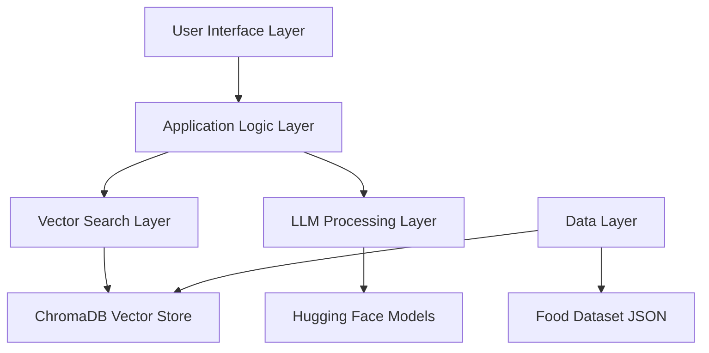

# System Architecture

## 🏗️ Architecture Overview

The Food Recommendation System follows a **modular, layered architecture** designed for scalability and maintainability.



## 🔄 System Components

### 1. **User Interface Layer**
- **Interactive CLI** - Real-time search interface
- **RAG Chatbot** - Conversational AI interface
- **Comparison Tool** - Side-by-side query analysis

### 2. **Application Logic Layer**
- **Search Orchestration** - Query processing and result aggregation
- **Session Management** - User interaction state
- **Result Formatting** - Output presentation logic

### 3. **Vector Search Layer**
- **ChromaDB Integration** - Vector storage and retrieval
- **Embedding Generation** - Text-to-vector conversion
- **Similarity Computation** - Semantic matching algorithms

### 4. **LLM Processing Layer**
- **FLAN-T5 Integration** - Natural language generation
- **RAG Pipeline** - Retrieval-augmented generation
- **Response Optimization** - Context-aware text generation

### 5. **Data Layer**
- **Food Dataset** - Structured food information
- **Vector Embeddings** - Pre-computed similarity vectors
- **Metadata Storage** - Cuisine, calories, ingredients data

## 🔗 Component Interactions

### **Search Flow**
```python
User Query → Embedding → Vector Search → ChromaDB → Results → LLM → Response
```

### **RAG Flow**
```python
User Input → Context Retrieval → Prompt Engineering → LLM Generation → Formatted Response
```

## 🎯 Design Patterns

### **1. Repository Pattern**
```python
class FoodRepository:
    def search_similar(query: str) -> List[Food]
    def get_by_cuisine(cuisine: str) -> List[Food]
    def filter_by_calories(max_cal: int) -> List[Food]
```

### **2. Strategy Pattern**
```python
class SearchStrategy:
    def execute(query: str) -> SearchResults

class VectorSearchStrategy(SearchStrategy):
    # Vector similarity implementation
    
class FilterSearchStrategy(SearchStrategy):  
    # Metadata filtering implementation
```

### **3. Facade Pattern**
```python
class FoodRecommendationFacade:
    def recommend(query: str) -> Recommendations
    def compare(query1: str, query2: str) -> Comparison
    def chat(message: str) -> Response
```

## 📊 Data Architecture

### **Input Data Structure**
```json
{
  "food_name": "Chicken Tikka Masala",
  "cuisine_type": "Indian", 
  "food_calories_per_serving": 450,
  "food_description": "Creamy tomato-based curry...",
  "food_ingredients": ["chicken", "tomatoes", "cream"],
  "food_health_benefits": "High protein, rich in spices",
  "cooking_method": "Grilled and simmered",
  "taste_profile": "Spicy, creamy, aromatic"
}
```

### **Vector Storage Schema**
```python
Collection: "food_recommendations"
- Documents: Food descriptions + metadata
- Embeddings: 384-dimensional vectors (all-MiniLM-L6-v2)
- Metadata: Structured food attributes
- IDs: Unique food identifiers
```

## 🔧 Technology Stack Architecture

### **Core Technologies**
| Layer | Technology | Purpose |
|-------|------------|---------|
| **Embedding** | Sentence Transformers | Text → Vector conversion |
| **Vector DB** | ChromaDB | Similarity search & storage |
| **LLM** | FLAN-T5 Base | Natural language generation |
| **Framework** | Python | Application development |
| **Environment** | Pixi | Dependency management |

### **Integration Points**
```python
# Embedding Integration
embedder = SentenceTransformer('all-MiniLM-L6-v2')
vectors = embedder.encode(food_descriptions)

# ChromaDB Integration  
collection = chroma_client.create_collection("foods")
collection.add(documents=docs, embeddings=vectors)

# LLM Integration
llm = pipeline("text2text-generation", "google/flan-t5-base")
response = llm(prompt)
```

## ⚡ Performance Architecture

### **Optimization Strategies**
1. **Vector Caching** - Pre-computed embeddings
2. **Batch Processing** - Efficient bulk operations
3. **Index Optimization** - ChromaDB HNSW indexing
4. **Memory Management** - Streaming for large datasets

### **Scalability Design**
- **Horizontal Scaling**: Multiple ChromaDB instances
- **Vertical Scaling**: Larger embedding models
- **Caching Layer**: Redis for frequent queries
- **Load Balancing**: Multiple LLM instances

## 🛡️ Error Handling Architecture

### **Resilience Patterns**
```python
# Circuit Breaker Pattern
class LLMCircuitBreaker:
    def call_llm(prompt: str) -> str:
        if failure_rate > threshold:
            return fallback_response()
        return actual_llm_call(prompt)

# Retry Pattern
@retry(max_attempts=3, backoff=exponential)
def vector_search(query: str) -> Results:
    return chromadb.search(query)
```

### **Graceful Degradation**
1. **LLM Failure** → Template-based responses
2. **ChromaDB Failure** → Simple text matching  
3. **Embedding Failure** → Keyword-based search
4. **Data Corruption** → Default recommendations

## 🔒 Security Architecture

### **Data Protection**
- **Input Validation** - Query sanitization
- **Rate Limiting** - Prevent abuse
- **Error Sanitization** - No sensitive info in errors
- **Audit Logging** - Track system usage

### **Model Security**
- **Local Processing** - No external API calls
- **Sandboxed Execution** - Isolated model inference
- **Resource Limits** - Prevent resource exhaustion

This architecture ensures **scalability**, **maintainability**, and **performance** while providing a solid foundation for food recommendation features.