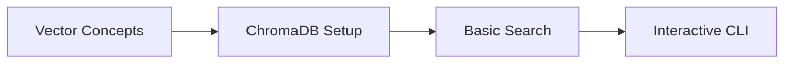
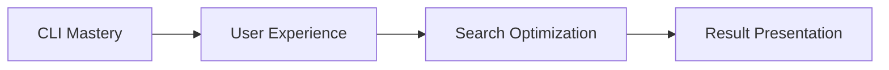
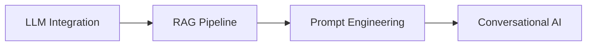

# Exercise Scripts Documentation

## 📚 Learning Objectives Overview

This directory contains progressive exercises designed to teach **vector database concepts**, **similarity search implementation**, and **conversational AI systems** through hands-on food recommendation scenarios.

## 🎯 Exercise Philosophy

Each exercise builds upon previous concepts while introducing new technical challenges:

1. **Foundation** → Vector embeddings and similarity search
2. **Application** → Interactive user interfaces  
3. **Intelligence** → RAG systems and conversational AI
4. **Integration** → Complete end-to-end systems

## 📝 Exercise Scripts

### **Exercise 1: Interactive Search (`ex_interactive_search.py`)**

#### **🎯 Learning Idea**
Introduce students to **vector similarity search** through an interactive CLI interface that demonstrates how semantic search differs from keyword matching.

#### **📋 What It Teaches**
- **Vector Embeddings**: How text becomes searchable vectors
- **Similarity Metrics**: Understanding cosine similarity and distance
- **User Experience**: Building intuitive search interfaces
- **Real-time Interaction**: Processing queries dynamically

#### **🔧 Technical Concepts**
```python
# Key concepts demonstrated:
- ChromaDB collection creation and management
- Sentence transformer embeddings (all-MiniLM-L6-v2)
- Interactive CLI design patterns
- Search result ranking and presentation
- User session management and history tracking
```

#### **💡 Core Learning Outcomes**
- **Semantic Search**: Students see how "spicy comfort food" matches "Chicken Tikka Masala" 
- **Similarity Scores**: Understanding percentage matches and ranking
- **Interactive Design**: CLI patterns for real-time user interaction
- **Data Structure**: How food metadata enhances search results

#### **🚀 Usage Scenarios**
```bash
# Basic search demonstration
python ex_interactive_search.py

# Example interactions:
Search: "Italian pasta"          # Shows cuisine-based matching
Search: "healthy low calorie"    # Demonstrates multi-attribute search
Search: "spicy comfort food"     # Shows semantic understanding
```

#### **📊 Expected Student Insights**
1. **"Aha!" Moment**: Realizing semantic search finds "Pad Thai" for "spicy noodles"
2. **Technical Understanding**: Seeing how embeddings capture meaning beyond keywords
3. **UX Appreciation**: Learning how to make AI accessible through simple interfaces
4. **Data Appreciation**: Understanding how rich metadata improves recommendations

---

### **Exercise 2: Enhanced RAG Chatbot (`enhanced_rag_chatbot.py`)**

#### **🎯 Learning Idea**
Advance students from simple search to **intelligent conversation** by implementing a complete RAG (Retrieval-Augmented Generation) system that combines vector search with natural language generation.

#### **📋 What It Teaches**
- **RAG Architecture**: Retrieval + Generation pipeline design
- **LLM Integration**: Using Hugging Face transformers locally
- **Context Engineering**: Building effective prompts for food recommendations
- **Conversational Flow**: Managing multi-turn conversations
- **AI Safety**: Fallback strategies when AI fails

#### **🔧 Technical Concepts**
```python
# Advanced concepts demonstrated:
- RAG pipeline: Query → Retrieve → Generate → Respond
- FLAN-T5 integration for local text generation
- Dynamic prompt engineering based on search results
- Conversation state management
- Graceful error handling and fallbacks
```

#### **💡 Advanced Learning Outcomes**
- **RAG Understanding**: How retrieval enhances generation quality
- **LLM Prompting**: Crafting effective prompts for specific domains
- **AI Reasoning**: Seeing how AI explains "why" recommendations make sense
- **System Integration**: Combining multiple AI models into coherent systems

#### **🚀 Usage Scenarios**
```bash
# RAG chatbot demonstration
python enhanced_rag_chatbot.py

# Progressive interaction examples:
Query: "healthy breakfast"
# Shows: Vector search + AI explanation of nutritional benefits

Query: "compare Italian vs Thai food"  
# Shows: Multi-query processing + comparative analysis

Query: "spicy food but I'm lactose intolerant"
# Shows: Complex constraint handling + personalized recommendations
```

#### **📊 Expected Student Insights**
1. **RAG Power**: Seeing how retrieval improves AI accuracy and relevance
2. **Local AI**: Understanding you can run powerful AI without external APIs
3. **Prompt Engineering**: Learning how prompt design affects AI quality
4. **Conversational AI**: Appreciating the complexity of natural dialogue systems

---

## 🎓 Progressive Learning Path

### **Phase 1: Foundation (Week 1-2)**


**Focus**: Understanding how computers "understand" text through vectors

### **Phase 2: Application (Week 3-4)**  


**Focus**: Building user-facing applications with AI backends

### **Phase 3: Intelligence (Week 5-6)**


**Focus**: Adding intelligence and natural language capabilities

## 🛠️ Development Progression

### **Exercise Evolution Pattern**
1. **Start Simple**: Basic vector search with minimal interface
2. **Add Intelligence**: Incorporate LLM for natural responses  
3. **Enhance UX**: Improve interaction patterns and feedback
4. **Add Features**: History, comparison, advanced filtering

### **Code Quality Progression**
```python
# Evolution from simple to sophisticated:

# Exercise 1: Direct function calls
results = search_food(query)

# Exercise 2: Object-oriented design  
class FoodRecommendationSystem:
    def recommend_with_ai(self, query: str) -> AIResponse

# Future exercises: Advanced patterns
class RAGOrchestrator:
    async def process_conversation(self, context: ConversationContext)
```

## 🎯 Assessment Criteria

### **Technical Mastery Indicators**
- [ ] **Vector Understanding**: Can explain how embeddings work
- [ ] **Search Quality**: Achieves relevant results for diverse queries
- [ ] **RAG Implementation**: Successfully combines retrieval + generation
- [ ] **Error Handling**: Graceful failures and user feedback
- [ ] **Code Quality**: Clean, documented, maintainable code

### **Conceptual Understanding Indicators**  
- [ ] **AI vs Traditional Search**: Can articulate the differences
- [ ] **When to Use RAG**: Understands appropriate use cases
- [ ] **Prompt Engineering**: Can craft effective LLM prompts
- [ ] **System Design**: Appreciates scalability and architecture concerns

## 🚀 Extension Opportunities

### **For Advanced Students**
1. **Multi-Modal Search**: Add image-based food search
2. **Personalization**: User preference learning and adaptation
3. **Real-time Updates**: Streaming responses and live data updates
4. **Performance Optimization**: Caching, indexing, and speed improvements

### **For Research-Minded Students**
1. **Embedding Comparison**: Test different embedding models
2. **RAG Variations**: Experiment with different retrieval strategies
3. **Evaluation Metrics**: Develop systematic quality measurements
4. **Domain Adaptation**: Apply concepts to other domains (books, movies, etc.)

## 📈 Success Metrics

### **Engagement Indicators**
- Students experiment beyond basic requirements
- Questions shift from "how" to "why" and "what if"
- Voluntary enhancement of UI/UX elements
- Creative query exploration and testing

### **Learning Evidence**
- Accurate explanations of vector similarity concepts
- Successful prompt engineering for new scenarios
- Independent debugging of search relevance issues
- Thoughtful discussion of AI limitations and ethics

## 🎉 Learning Celebration Moments

### **"Wow" Moments to Expect**
1. **First Semantic Match**: When "comfort food" finds "Mac and Cheese"
2. **AI Explanation**: When the system explains WHY foods match the query
3. **Natural Conversation**: When the chatbot maintains context across turns
4. **Personal Discovery**: When students find foods they actually want to try

These exercises transform abstract AI concepts into **tangible, delicious experiences** that students can immediately understand and appreciate! 🍽️✨